  

# Hi, I'm Dariusz 👋

**AI-Powered Test Automation Architect · Software Engineer · AI Tooling Builder**

I started by typing my first line of code on a Commodore 64.
A few decades later I build autonomous AI systems for software testing
and developer workflow automation.

**My approach: Context before LLM.**
Most "AI for QA" content says *"let AI write your tests"*.
I do the opposite - deterministic context engineering first,
LLMs second, only where they actually win.

🇵🇱 Warsaw, Poland · 🌍 Available remote · ✉️ [darek@sdet.it](mailto:darek@sdet.it)

---

## Tech Stack

**Languages & Runtimes**

**Testing & QA**

**Frontend & Backend**

**AI / RAG / Agents**

-000000?style=flat-square&logoColor=white)

**Infra**

---

## GitHub Stats

  
  

  

---

## What I'm building

- 🔥 **[sdet-wcag-toolkit](https://github.com/darco81/sdet-wcag-toolkit)** - Static + dynamic + 5 AI specialists for WCAG 2.2 AA audits. AGPL-3.0.
- 🧠 **[sdet-brain](https://github.com/darco81/sdet-brain)** - Persistent RAG for a personal Markdown corpus. Local-first MLX + Qdrant, MCP server.
- 🛰️ **[skills-radar](https://github.com/darco81/skills-radar)** - Lazy-loading skill discovery for Claude Code over MCP. 100% local Apple Silicon (MLX) or Docker. MIT.
- ⚡ **[sdet-perf-toolkit](https://github.com/darco81/sdet-perf-toolkit)** - Context-first frontend performance audit. In-browser Lighthouse + web-vitals + trace, read by 5 AI specialists. AGPL-3.0.
- 🏗️ **[cdat-pattern](https://github.com/darco81/cdat-pattern)** - Components-Data-Actions-Tests. 4-layer architecture for maintainable Playwright tests. MIT.
- 🧩 **[jarvis-brain-core](https://github.com/darco81/jarvis-brain-core)** - Code-graph context over MCP for coding agents. Educational distillate. AGPL-3.0.

**Live**

- 🚀 **[portfolio.sdet.it](https://portfolio.sdet.it)** - Case studies + "From the field" series (EN)
- 🚀 **[portfolio.sdet.pl](https://portfolio.sdet.pl)** - PL mirror
- 🌐 **[sdet.it](https://sdet.it)** - Services portal *(in progress)*

---

## Find me

